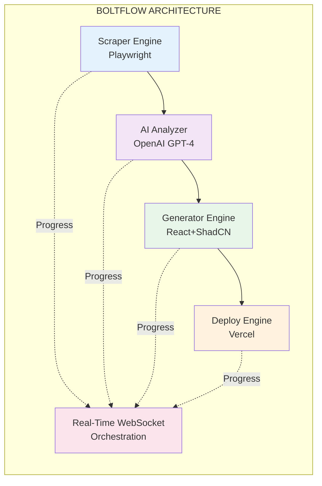
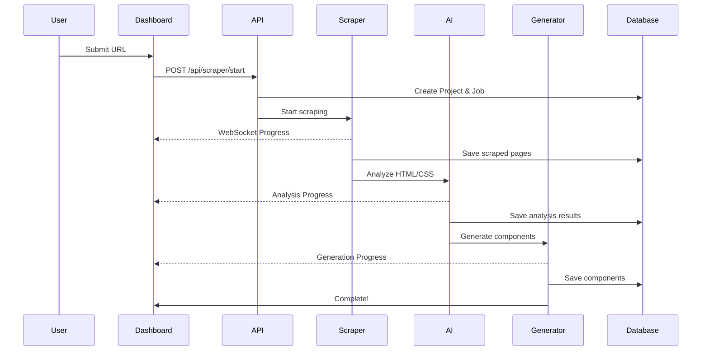

# ⚡ Boltflow - AI-Driven Web Migration System

**Transform legacy websites into modern web applications using AI**

[](https://nextjs.org/)
[](https://www.typescriptlang.org/)
[](https://reactjs.org/)
[](./LICENSE)

---

## 🎯 Overview

Boltflow is an experimental AI system that automates the migration of existing websites or design exports into fully functional, modern Next.js + React applications with headless CMS integration and automated deployment.

### Key Features

- 🤖 **AI-Powered Analysis** - GPT-4 driven structural analysis and component detection
- ⚡ **Real-Time Orchestration** - WebSocket-based live progress updates
- 🎨 **Component Generation** - Automatic conversion to modern React + ShadCN UI
- 📊 **Smart Pricing** - ML-based complexity scoring and cost estimation
- 🔄 **Multi-CMS Support** - Unified integration with Supabase, Sanity, Hygraph, Strapi
- 🚀 **Auto-Deployment** - One-click deployment to Vercel with CI/CD
- 📱 **Beautiful Dashboard** - Modern UI built with Next.js 14 + Tailwind

---

## 🏗️ Architecture



---

## 🚀 Quick Start

### Prerequisites

- Node.js >= 20.0.0
- Python >= 3.11 (for FastAPI backend)
- PostgreSQL (for database)
- Redis (or Docker)
- OpenAI API key

### Installation

```bash
# Clone the repository
git clone https://github.com/krhebbar/boltflow.git
cd boltflow

# Run the setup script
./scripts/setup.sh

# Configure environment variables
cp .env.example .env
# Edit .env and add your credentials:
# - DATABASE_URL
# - OPENAI_API_KEY
# - SECRET_KEY

# Start development servers
./scripts/dev.sh
```

Visit `http://localhost:3000` to see the dashboard.

**Or use Docker:**

```bash
docker-compose up
```

---

## 📦 Project Structure

```
boltflow/
├── apps/
│   ├── web/              # Next.js 14 dashboard (App Router)
│   └── api/              # FastAPI backend for AI pipelines
├── packages/
│   ├── db/               # Database schema (Drizzle ORM + SQLAlchemy)
│   ├── ui/               # Shared ShadCN component library
│   ├── cms/              # CMS connectors (Supabase/Sanity/etc)
│   └── generators/       # Code generation templates
├── docs/                 # Documentation
└── docker/               # Docker configurations
```

---

## 🎨 Tech Stack

### Frontend
- **Next.js 14** - App Router, React Server Components
- **React 18** - Component library
- **TypeScript 5.3** - Type safety
- **ShadCN UI** - Modern component library (Radix + Tailwind)
- **Tailwind CSS** - Utility-first styling
- **TanStack Query** - Server state management
- **Socket.io** - Real-time updates

### Backend
- **FastAPI** (Python) - AI/ML processing
- **SQLAlchemy** - ORM with PostgreSQL
- **Redis** - Job queue and caching
- **Playwright** - Web scraping

### AI/ML
- **OpenAI GPT-4 Turbo** - Structural analysis
- **Text Embeddings** - Component similarity

### Infrastructure
- **PostgreSQL** - Primary database
- **Redis** - Cache, queue, pub/sub
- **Docker** - Containerization

---

## 🔄 How It Works



### 1. Web Scraping
```typescript
// Input a URL
await scraper.scrape('https://example.com')
// → Crawls entire site, extracts HTML/CSS/assets
```

### 2. AI Analysis
```typescript
// Analyzes structure and patterns
const analysis = await analyzer.analyze(scrapedData)
// → Detects sections, components, complexity
```

### 3. Component Generation
```typescript
// Generates modern React components
const components = await generator.generate(analysis)
// → Creates Next.js pages with ShadCN UI
```

### 4. CMS Integration
```typescript
// Maps content to CMS schema
await cms.sync({
  provider: 'supabase',
  content: extractedContent
})
```

### 5. Deployment
```typescript
// One-click deploy
await deploy.toVercel({
  project: generatedCode,
  env: envVariables
})
```

---

## 📊 Features in Detail

### Real-Time Dashboard
- Live scraping progress
- AI analysis visualization
- Cost estimation updates
- Component preview
- Deployment status

### AI-Powered Analysis
- Page type classification
- Section detection (header, hero, features, footer)
- Component pattern matching
- Complexity scoring
- Semantic similarity search

### Multi-CMS Support
- **Supabase** - PostgreSQL + Realtime
- **Sanity** - GROQ queries
- **Hygraph** - GraphQL API
- **Strapi** - REST + GraphQL

### Component Generation
- HTML → React JSX transformation
- ShadCN UI component mapping
- Tailwind CSS styling
- TypeScript types generation
- Next.js 14 patterns (Server Components)

### Style Guide Generation
- Color palette extraction
- Typography system
- Spacing scale
- Design tokens export
- Interactive style guide UI

---

## 🛠️ Development

### Running Locally

```bash
# Start all services
npm run dev

# Or run individual apps
npm run dev --filter=web   # Next.js dashboard
npm run dev --filter=api   # FastAPI backend
```

### Building for Production

```bash
npm run build
```

### Running Tests

```bash
npm run test
```

---

## 📚 Documentation

- [Architecture](./docs/ARCHITECTURE.md) - System design and patterns
- [API Documentation](./docs/API.md) - REST and WebSocket endpoints
- [Deployment](./docs/DEPLOYMENT.md) - Production deployment guide
- [Implementation Status](./IMPLEMENTATION_STATUS.md) - Current implementation details
- [Code Review](./CODE_REVIEW_REPORT.md) - Comprehensive code review

---

## 📈 Project Status

**Current Status:** 🚧 In Active Development

### Completed ✅
- [x] Project setup (Turborepo, Next.js 14)
- [x] **Authentication system with JWT**
- [x] **Database layer with PostgreSQL**
- [x] **Complete error handling**
- [x] **State management with TanStack Query**
- [x] **WebSocket real-time updates**
- [x] Web scraping engine (Playwright)
- [x] Dashboard UI foundation
- [x] AI analysis pipeline (GPT-4)
- [x] Docker configuration
- [x] Setup scripts and automation
- [x] Comprehensive documentation

### In Progress 🚧
- [ ] Component generation engine
- [ ] Multi-CMS integration layer
- [ ] Testing infrastructure
- [ ] Monitoring and observability

### Future Enhancements 🔮
- [ ] GitHub integration for automatic repo creation
- [ ] VS Code extension
- [ ] Automated testing generation
- [ ] Advanced component customization
- [ ] Multi-language support
- [ ] CLI tool
- [ ] Production deployment examples

**Production Readiness:** ~55/100 (improving rapidly)

See [IMPLEMENTATION_STATUS.md](./IMPLEMENTATION_STATUS.md) for detailed progress.

---

## 🤝 Contributing

Feedback and suggestions are welcome! See [CONTRIBUTING.md](./CONTRIBUTING.md) for guidelines.

---

## 📄 License

MIT License - see [LICENSE](./LICENSE) for details.

---

## 👨‍💻 Author

**Ravindra Kanchikare** - [GitHub](https://github.com/krhebbar)

---

**Built with ❤️ as an experimental open-source project**
