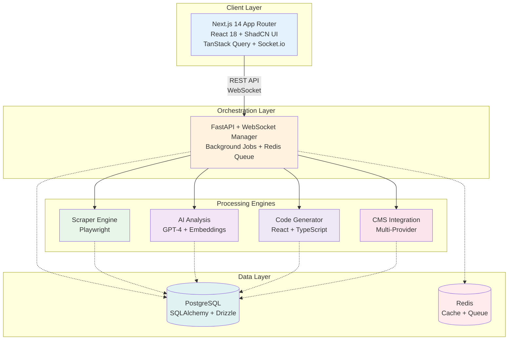
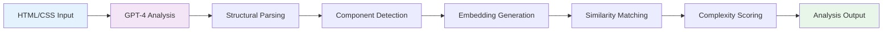
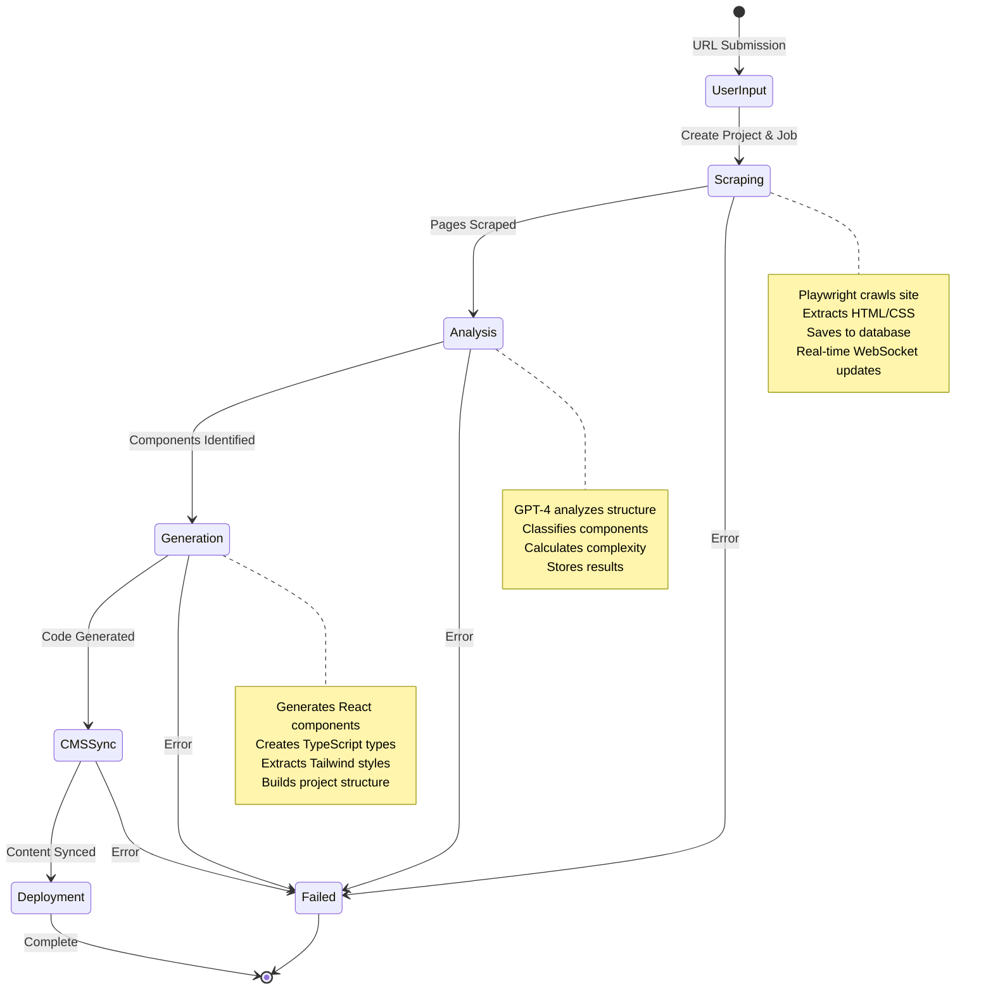
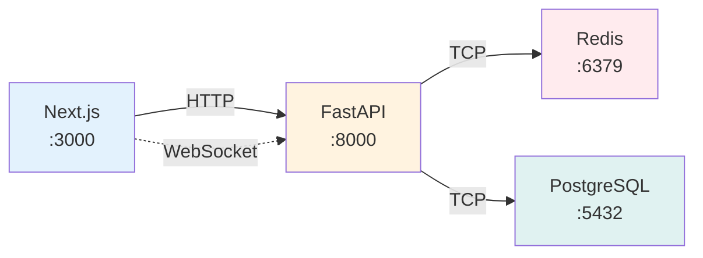
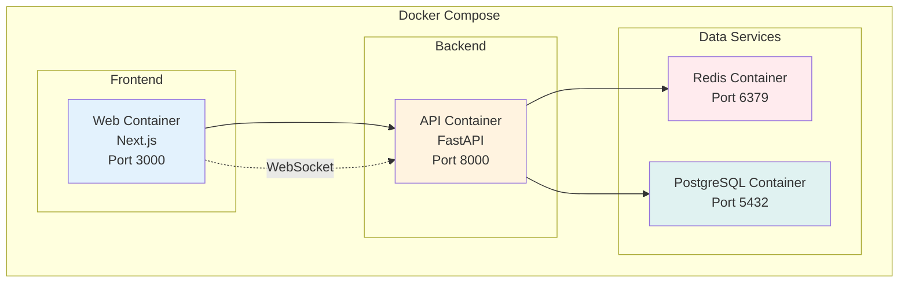
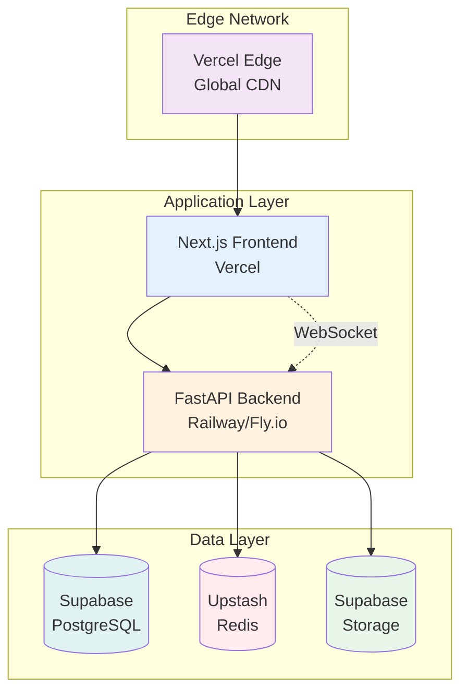
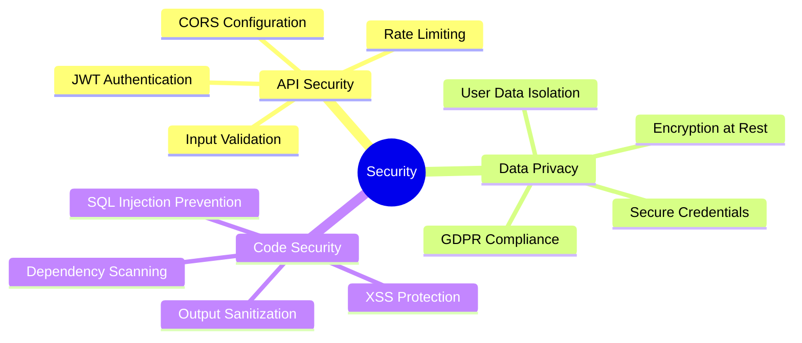
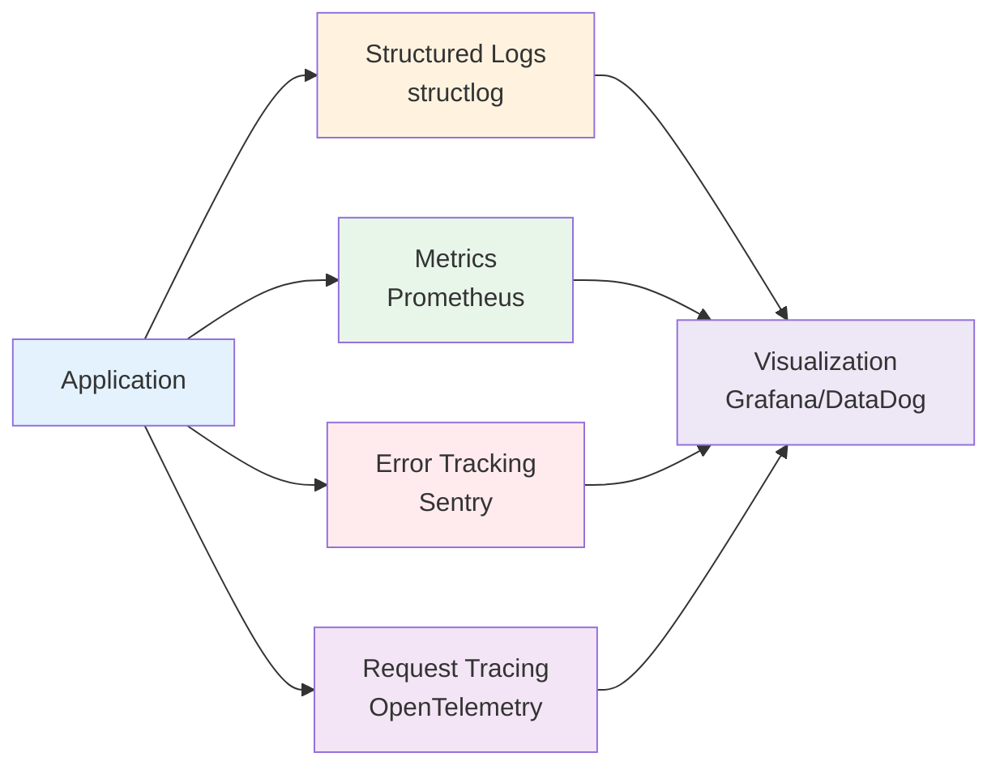
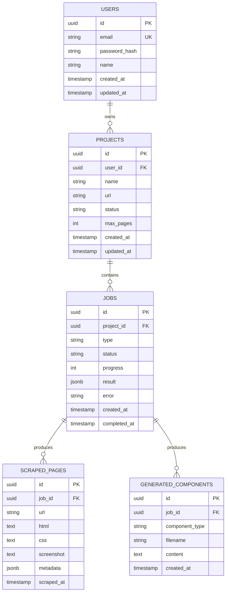

# Boltflow Architecture

## Overview

Boltflow is an experimental AI-driven web migration system that transforms legacy websites into modern Next.js applications with automated component generation, CMS integration, and deployment.

## System Architecture



## Core Components

### 1. Frontend Layer (Next.js 14)

**Location:** `apps/web/`

**Technology Stack:**
- Next.js 14 with App Router
- React 18 with TypeScript
- ShadCN UI (Radix primitives + Tailwind)
- TanStack Query for server state
- Socket.io client for real-time updates

**Key Features:**
- Server-side rendering for optimal performance
- Real-time progress tracking via WebSocket
- Responsive dashboard for project management
- Component preview and code viewer

**File Structure:**
```
apps/web/
├── src/
│   ├── app/              # App Router pages
│   │   ├── (auth)/       # Auth pages (login, signup)
│   │   ├── dashboard/    # Dashboard pages
│   │   └── page.tsx      # Landing page
│   ├── components/       # React components
│   │   ├── ui/          # ShadCN UI components
│   │   └── dashboard/   # Dashboard-specific
│   ├── providers/        # Context providers
│   ├── hooks/            # Custom React hooks
│   ├── lib/              # Utilities and API client
│   └── types/            # TypeScript types
└── public/              # Static assets
```

### 2. Backend Layer (FastAPI)

**Location:** `apps/api/`

**Technology Stack:**
- FastAPI (Python 3.11+)
- SQLAlchemy with asyncpg
- Playwright for web scraping
- OpenAI GPT-4 for AI analysis
- Redis for caching and job queues
- WebSocket for real-time communication

**Architecture Patterns:**
- Router-based modular design
- Async/await throughout
- Background task processing
- Event-driven WebSocket updates
- Custom exception hierarchy
- Structured logging with structlog

**File Structure:**
```
apps/api/
├── main.py              # FastAPI app entry
├── config/              # Configuration
│   ├── database.py      # Database session management
│   └── settings.py      # Pydantic settings
├── models/              # SQLAlchemy models
│   ├── user.py
│   ├── project.py
│   ├── job.py
│   └── ...
├── routers/             # API endpoints
│   ├── auth.py         # Authentication
│   ├── scraper.py      # Web scraping
│   ├── analyzer.py     # AI analysis
│   ├── generator.py    # Code generation
│   └── cms.py          # CMS integration
├── lib/                 # Core utilities
│   ├── auth.py         # JWT authentication
│   ├── exceptions.py   # Custom exceptions
│   └── websocket_manager.py
├── middleware/          # FastAPI middleware
│   └── error_handler.py
├── ai/                  # AI modules
│   ├── analyzer.py     # DOM analysis
│   └── classifier.py   # Component classification
└── scrapers/            # Scraping engines
    └── playwright_scraper.py
```

### 3. AI Analysis Pipeline



**Flow:**
1. **DOM Analysis** (GPT-4)
   - Extract semantic structure
   - Identify component boundaries
   - Classify sections (header, nav, hero, etc.)

2. **Component Classification** (Embeddings)
   - Generate text embeddings for sections
   - Match against component patterns
   - Calculate similarity scores

3. **Complexity Scoring** (ML Model)
   - Analyze component complexity
   - Estimate development effort
   - Generate pricing quotes

**Models Used:**
- `gpt-4-turbo-preview` for structural analysis
- `text-embedding-ada-002` for semantic similarity
- Custom scoring model for complexity

### 4. Code Generation Engine

**Process:**
1. Parse analyzed component data
2. Select UI library (ShadCN, Material-UI, Chakra)
3. Transform HTML → React JSX
4. Generate TypeScript component files
5. Extract and adapt styles
6. Create project structure

**Output:**
- TypeScript React components
- CSS modules / Tailwind classes
- Next.js page structure
- Type definitions

### 5. CMS Integration Layer

**Supported Providers:**
- **Supabase** - PostgreSQL + Realtime
- **Sanity** - Headless CMS
- **Hygraph** - GraphQL CMS
- **Strapi** - Open-source CMS

**Integration Pattern:**
```typescript
interface CMSProvider {
  connect(credentials: Credentials): Promise<Connection>
  createSchema(components: Component[]): Promise<Schema>
  migrate(data: Data[]): Promise<Result>
}
```

### 6. Real-time Orchestration

**WebSocket Manager:**
- Maintains active client connections
- Broadcasts progress updates
- Handles client reconnection
- Coordinates multi-step workflows

**Job Queue (Redis):**
- Background job processing
- Retry logic for failed tasks
- Progress tracking
- Job status persistence in database

## Data Flow

### Migration Workflow



**Detailed Steps:**

1. **User Input**
   - URL submission
   - Configuration (max pages, UI library, CMS)
   - Authentication required

2. **Web Scraping (Playwright)**
   - Crawl website
   - Extract HTML/CSS
   - Capture screenshots
   - Save to database
   - Broadcast progress via WebSocket

3. **AI Analysis (GPT-4 + Embeddings)**
   - Analyze DOM structure
   - Classify components
   - Extract design tokens
   - Calculate complexity
   - Store analysis results

4. **Code Generation**
   - Generate React components
   - Create page structure
   - Adapt styles to Tailwind
   - Generate TypeScript types
   - Save to database

5. **CMS Integration (Optional)**
   - Create content schema
   - Migrate content
   - Configure API
   - Test integration

6. **Output**
   - Generated code (ZIP download)
   - GitHub repository
   - Vercel deployment

## Deployment Architecture

### Development Environment



### Production (Docker)



### Cloud Deployment



**Recommended Services:**
- **Frontend:** Vercel Edge Network
- **Backend:** Railway / Fly.io
- **Database:** Supabase (PostgreSQL)
- **Cache:** Upstash (Redis)
- **Storage:** Supabase Storage / S3

## Security Considerations



1. **API Security**
   - JWT authentication with bcrypt
   - CORS configuration (no wildcards)
   - Rate limiting per user
   - Input sanitization and validation

2. **Data Privacy**
   - Database encryption at rest
   - Secure credential storage
   - User data isolation
   - Compliance with data protection regulations

3. **Code Generation**
   - Safe template rendering
   - Output sanitization
   - Dependency security scanning
   - No arbitrary code execution

## Performance Optimizations

1. **Frontend**
   - Server-side rendering
   - Image optimization
   - Code splitting
   - Edge caching
   - React Server Components

2. **Backend**
   - Redis caching for AI results
   - Background job processing
   - Database connection pooling
   - Async operations throughout
   - Query optimization with indexes

3. **AI Pipeline**
   - Prompt optimization
   - Response caching (1 hour TTL)
   - Batch processing where possible
   - Token usage optimization
   - Rate limit handling with retries

## Monitoring & Observability



**Implemented:**
- Structured logging with structlog (JSON output)
- Request/response logging
- Error tracking with custom exceptions
- WebSocket connection monitoring
- Database query logging

**Planned:**
- Sentry integration for error tracking
- Prometheus metrics
- Performance monitoring (APM)
- Health check endpoints with dependency verification
- Alerting for critical failures

## Database Schema



## Future Enhancements

1. **Advanced Features**
   - Multi-page application support
   - State management generation (Zustand/Redux)
   - API endpoint generation from backend analysis
   - Database schema inference

2. **AI Improvements**
   - Fine-tuned models for better accuracy
   - Custom component library training
   - Automated testing generation
   - Code review and optimization suggestions

3. **Platform Extensions**
   - VS Code extension for inline migration
   - CLI tool for batch processing
   - Browser extension for one-click capture
   - Public API for programmatic access

4. **Infrastructure**
   - Kubernetes deployment support
   - Multi-region deployment
   - Advanced caching strategies
   - CDN integration for assets
